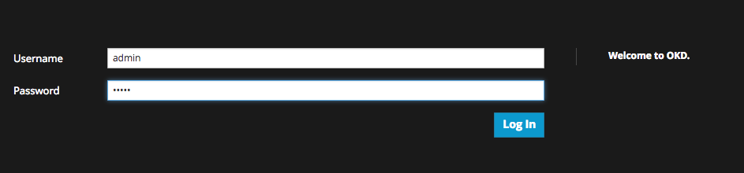
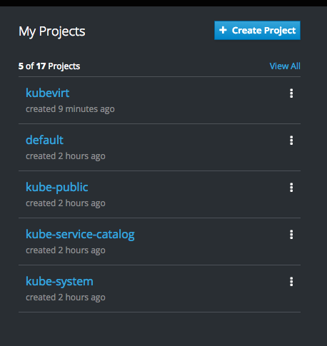

## Install KubeVirt

In this section, download the `kubevirt.yaml` file and explore it.  Then, apply it from the upstream github repo.

```
export VERSION=v0.7.0-alpha.2
```

Grab the kubevirt.yaml file to explore. Review the ClusterRole's, CRDs, ServiceAccounts, DaemonSets, Deployments, and Services.

```
wget https://github.com/kubevirt/kubevirt/releases/download/$VERSION/kubevirt.yaml
less kubevirt.yaml
```

Install KubeVirt. You should see several objects were created.
 
```
oc apply -f https://github.com/kubevirt/kubevirt/releases/download/$VERSION/kubevirt.yaml
```

Define the following policies for OpenShift.

```
oc adm policy add-scc-to-user privileged -n kube-system -z kubevirt-privileged
oc adm policy add-scc-to-user privileged -n kube-system -z kubevirt-controller
oc adm policy add-scc-to-user privileged -n kube-system -z kubevirt-apiserver
```

Give permissions to the qemu user for persistent volume claims 

```
setfacl -m user:107:rwx /root/openshift.local.clusterup/openshift.local.pv/pv*
```


Review the objects that KubeVirt added.

```
oc get sa --all-namespaces | grep kubevirt
oc describe sa kubevirt-apiserver --namespace=kube-system # Please feel free to explore the other objects as well. Get a feel for the expected output.
oc get pods --namespace=kube-system
oc describe pod -l kubevirt.io=virt-handler --namespace=kube-system
# review the files on the root of the filesystem of the pod, see the virt-handler executable, after replacing the pod name with yours
oc exec -it virt-handler-n9pxj --namespace=kube-system ls /  
oc get svc --namespace=kube-system
oc describe  svc virt-api --namespace=kube-system
```

There are other services and objects to take a look at.

To review the objects through the OpenShift web console, access the console and log in as the `developer` user at `https://student<number>.cnvlab.gce.sysdeseng.com:8443`

Open that URL in a browser, log in as the `developer` user with a password of `developer`.



Explore the kube-system project by clicking on the `View All` link in the right hand navigation pane.



Browse to the `kube-system` project and explore the objects. Click on the different objects, explore the environment.


#### Install virtctl

Return to the CLI and install virtctl. This tool provides quick access to the serial and graphical ports of a VM, and handle start/stop operations. Also run `virtctl` to get an idea of it's options.

```
curl -L -o virtctl https://github.com/kubevirt/kubevirt/releases/download/$VERSION/virtctl-$VERSION-linux-amd64
chmod -v +x virtctl
./virtctl --help
```


==== <<../lab4/lab4.adoc#lab4,Previous Lab: Prometheus and Grafana>>
==== <<../lab6/lab6.adoc#lab6,Next Lab: Building an Ansible Playbook Bundle to Aid in Cluster Management>>
==== <<../../README.adoc#lab1,Home>>
