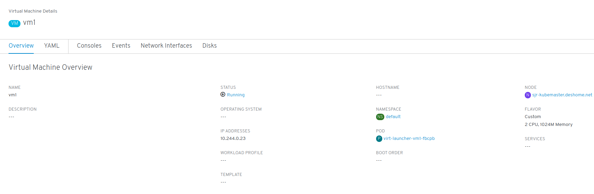
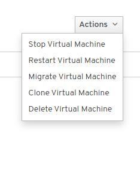
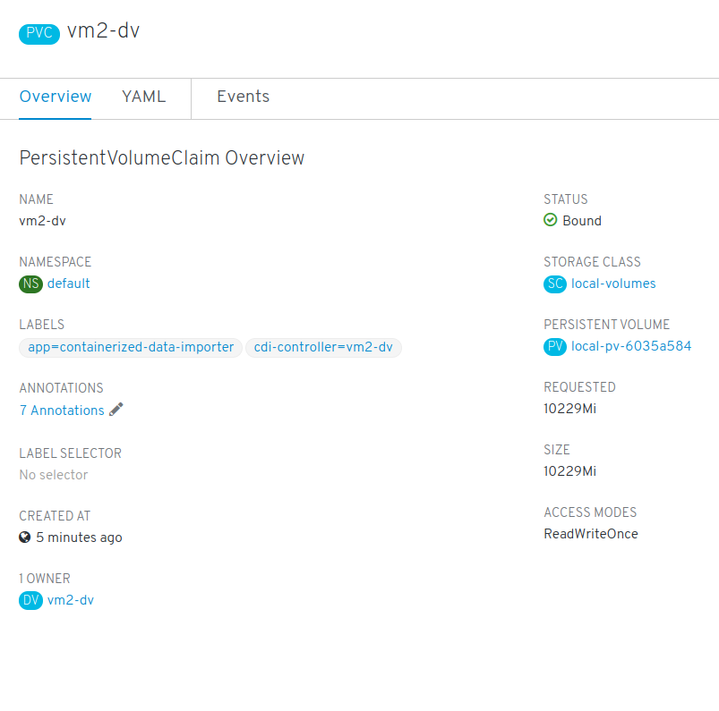

# Lab 6: Install and explore the KubeVirt Web UI

## Install the KubeVirt Web UI

In this lab we are going to deploy KubeVirt's web UI, which eases the management of VMs.

```console
$ cd ~/kubevirt/kubevirt-ui-custom-manifests
$ kubectl config set-context $(kubectl config current-context) --namespace=kubevirt
$ kubectl create -f kubevirt_ui.yml
$ kubectl wait pod -l app=kubevirt-web-ui --for condition=Ready --timeout=180s
pod/kubevirt-web-ui-qmpwl condition met
```

Now, check the three resources deployed for the Web UI:

```console
$ kubectl get all -l app=kubevirt-web-ui
NAME                        READY   STATUS    RESTARTS   AGE
pod/kubevirt-web-ui-qmpwl   1/1     Running   0          78m

NAME                                    DESIRED   CURRENT   READY   AGE
replicationcontroller/kubevirt-web-ui   1         1         1       78m

NAME                      TYPE       CLUSTER-IP     EXTERNAL-IP   PORT(S)          AGE
service/kubevirt-web-ui   NodePort   10.96.35.132   <none>        9000:30000/TCP   78m
```

**NOTE**: take a look at the kubevirt-web-ui service, the UI should be available on your node's assigned hostname at port 30000.

## Explore the KubeVirt UI

Using your browser, head to *http://<your_gcp_instance_hostname>:30000* and you'll be greeted by an status page showing the health of the cluster and a stream of events.


On the left side navigation bar, click on *Workloads* and then *VirtualMachines*, you'll be presented with a view of the defined VMs in the cluster, click on the *vm1* to open up its details page.



Notice all the available tabs, *YAML*, *Consoles*, ... click on *Consoles*


Click now on the *actions* button, it will present you with few options:



You can interact with the VM from the UI as well. The *Migrate Virtual Machine* action is not really available for this lab because we are running on a single node cluster (so we can't migrate a VM from one node to another), but clicking it on a multi-node cluster would trigger a live migration of the VM.

Now let's get back clicking on *Workloads*, *VirtualMachines* and review the details for *vm2*. Take a closer look to its disks by clicking on the *Disks* tab:


To see even more details, go to the *Storage* section and click on *Persistent Volume Claims*. There you will see a summary of *PVCs* on the selected namespace, and *vm2-dv* should be listed there. Click on it to see its details:



Here we can see that the PVC has an owner, the *vm2-dv* *DataVolume*, and that the PVC is attached to a Persistent Volume attached to this claim (in this case the *local-pv-2049c47d* *PV*).

## Recap

* We deployed the KubeVirt web UI
* We connected to the web UI, which is exposed on the node's IP at port 30000
  * Checked the VMs in the cluster
  * Checked available actions and attributes

This concludes this lab! Take your time exploring the UI and when your ready head to the next one!

[Next Lab](../lab7/lab7.md)\
[Previous Lab](../lab5/lab5.md)\
[Home](../../README.md)
