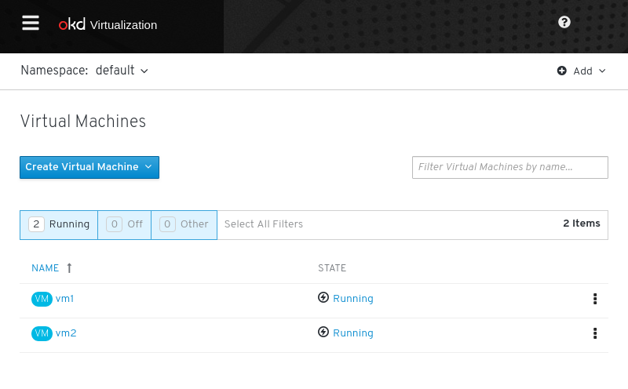
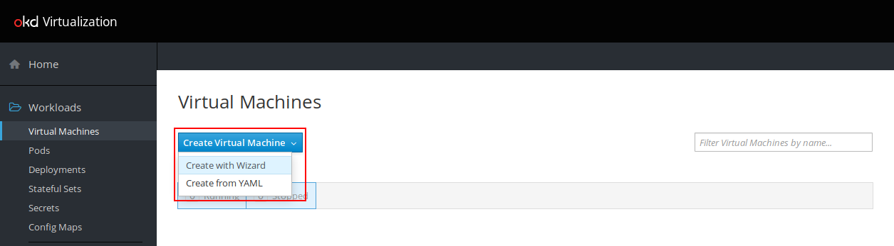
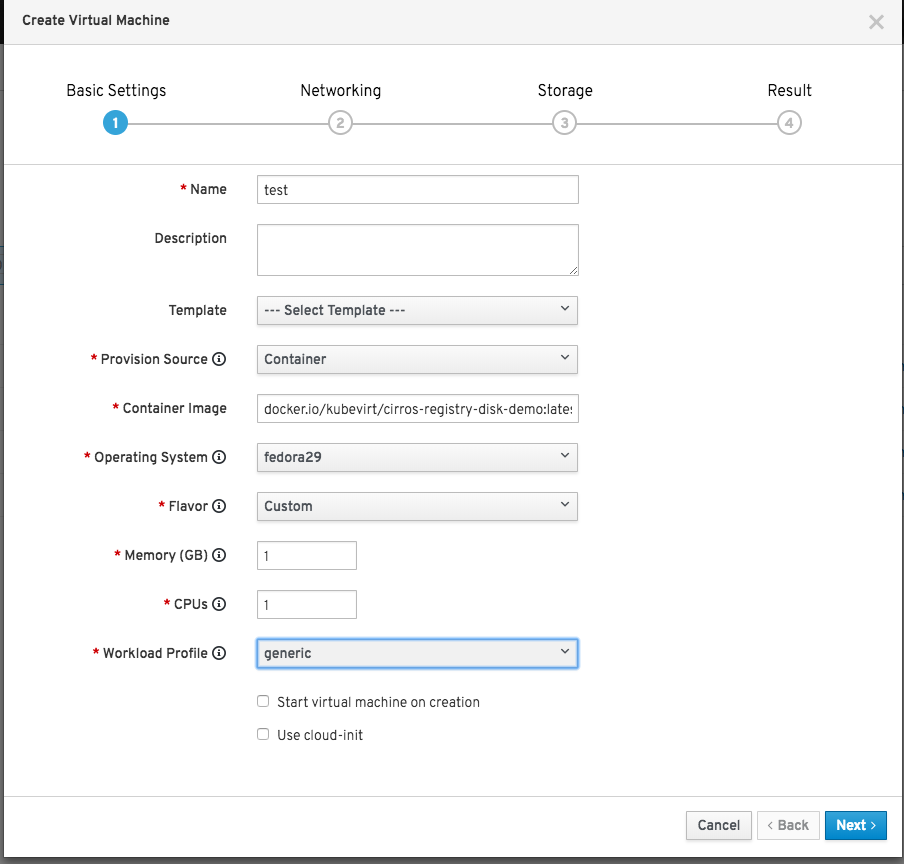
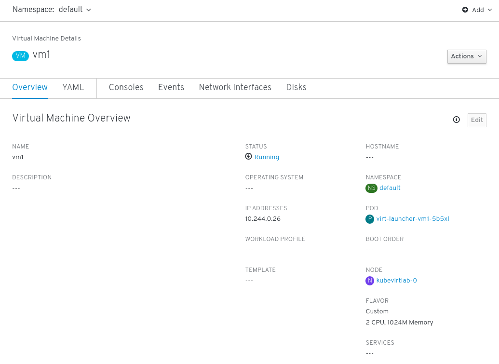
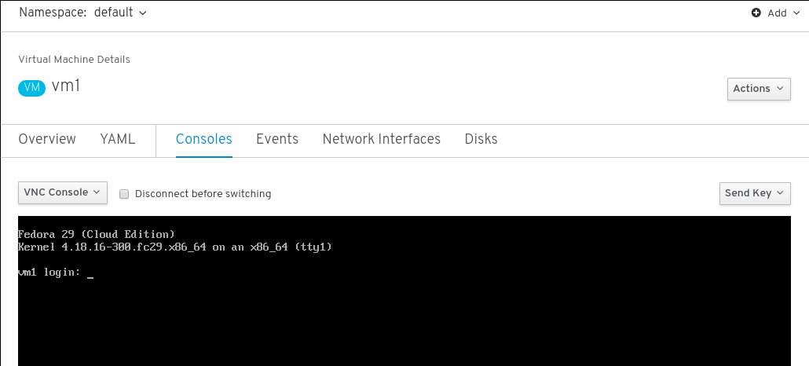
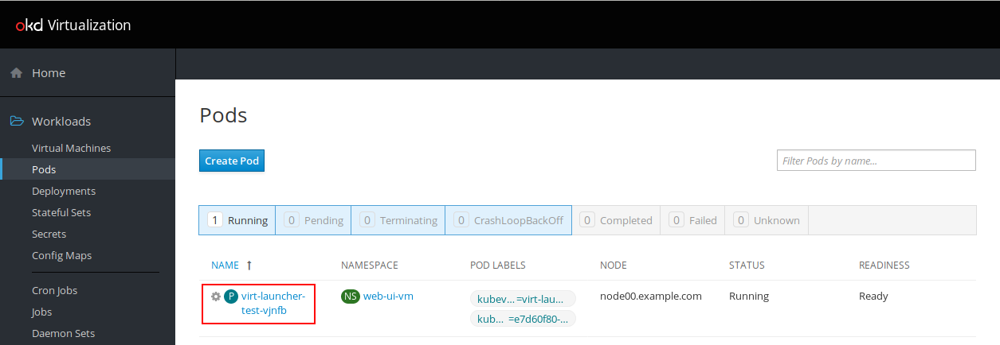
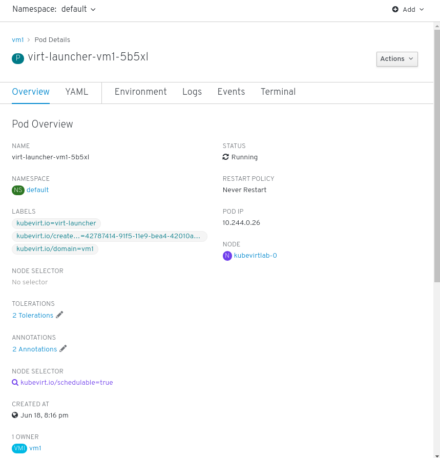

# Lab 7: Using the Kubevirt UI to interact with VMs

> **NOTE:** at the time of this writing, the WebUI is fully functional on
> OpenShift but not yet in Kubernetes (we are working on it! :D). In Kubernetes
> if you try to spin up a VM using the *wizard* the namespaces will not be
> shown; don't worry about that, just continue with the labs avoiding that part.

In this section, we will install and interact with VMs using KubeVirt's dedicated UI.

You can then access it at `http://kubevirtlab-<number>.<domain>:30000` and use it to:

* stop/start/delete/... VMs
* Create new ones
* Access VM consoles through your browser

## Using the KubeVirt web UI 

### Create a Virtual Machine

Click the `Create Virtual Machine` drop-down and select `Create with Wizard`

In the `Basic Settings` configure with the following

* Name: `vm3`
* Namespace: `myproject`
* Provision Source: `Container`
* Container Image: `docker.io/kubevirt/cirros-container-disk-demo:latest`
* Operating System: `fedora29`
* Flavor: `Custom`
* Memory: `1`
* CPUs: `1`
* Workload Profile: `generic`

Click `Next >` until result and finish.

### Controlling the State of the VM

To start the virtual machine click the cog and select `Start Virtual Machine`.

Now click the virtual machine link `vm3`

### Virtual Machine Overview and Console

Click *Consoles* to view graphical (VNC) console.

### Associated Pods

Clicking `Pods` will show the currently running pods for this namespace.

Then clicking the `virt-launcher-vm3-RANDOM` link will provide an overview.

This concludes this section of the lab.

[Next Lab](../lab8/lab8.md)\
[Previous Lab](../lab6/lab6.md)\
[Home](../../README.md)
