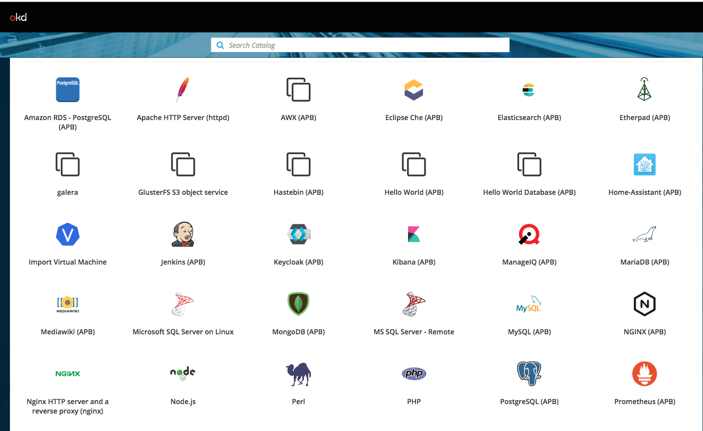
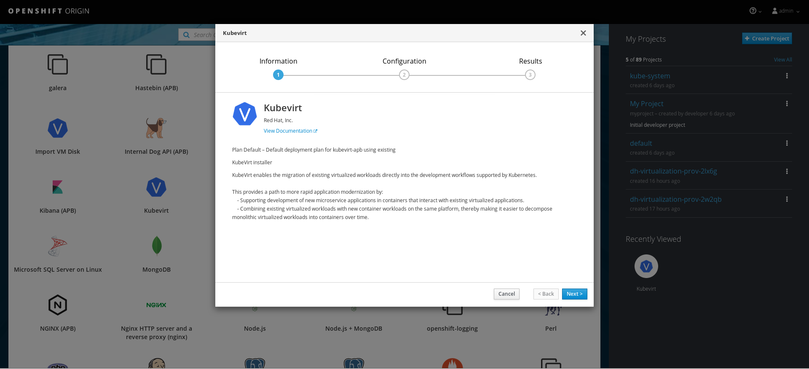
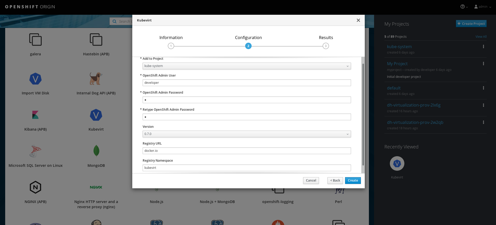
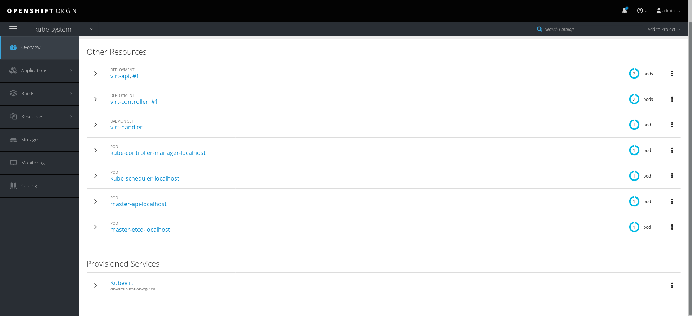

## APBs and the Service Catalog

You can provision KubeVirt using APBs through the Service Catalog.

Navigate to `https://student<number>.cnvlab.gce.sysdeseng.com:8443` in your browser.

Click the `Kubevirt` icon in the catalog to pull up the info page, then click `Next`.

Configure KubeVirt.  Enter a user and password of an admin user (user: `developer` password: <any>) and fill out any fields.

Enter the namespace where you launched kubevirt and watch it get provisioned.

Click the `Virtualization` tab to see any VM templates you want to create.

[Next Lab](../lab9/lab9.md)\
[Previous Lab](../lab7/lab7.md)\
[Home](../../README.md)
