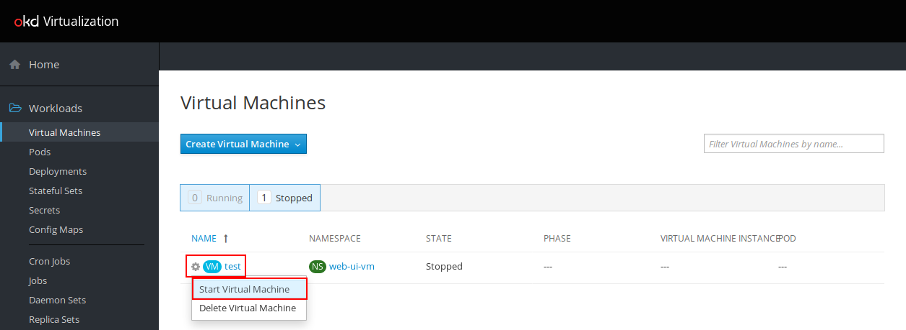
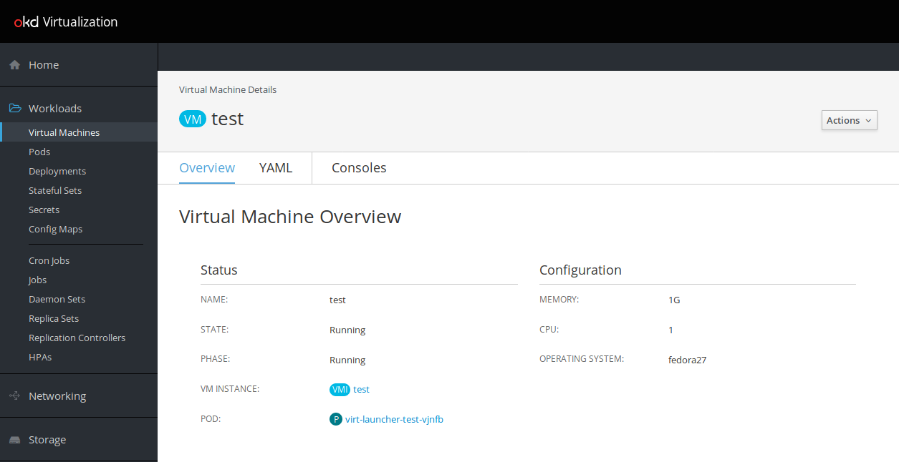
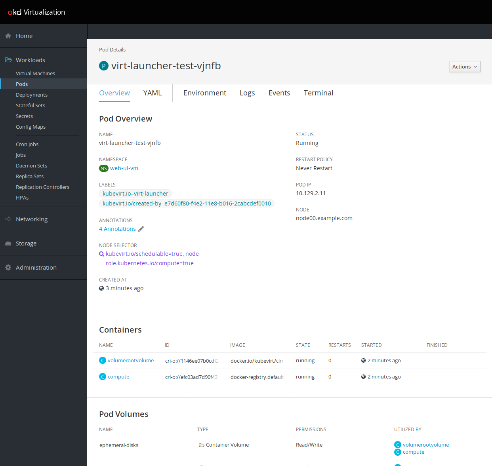

## Kubevirt UI

You can also interact with kubevirt using the dedicated UI

### Install kubevirt web ui
First Install it

```
oc new-project kweb-ui
oc apply -f kubevirt-web-ui.yaml
oc adm policy add-cluster-role-to-user cluster-admin system:serviceaccount:kweb-ui:default
oc project myproject
```

You can then access it at `http://kubevirt-web-ui-kweb-ui.student<number>.cnvlab.gce.sysdeseng.com` and use it to 

- stop/start/delete vms
- create ones
- access vm console through your browser


### Using the kubevirt web ui 

#### Create a Virtual Machine

Click the `Create Virtual Machine` drop-down and select `Create with Wizard`


In the `Basic Settings` configure with the following

- Name: `vm3`
- Namespace: `myproject`
- Provision Source: `Container`
- Container Image: `docker.io/kubevirt/cirros-registry-disk-demo:latest`
- Operating System: `fedora29`
- Flavor: `Custom`
- Memory: `1`
- CPUs: `1`
- Workload Profile: `generic`


Click `Next >` until result and finish.

#### Controlling the State of the VM

To start the virtual machine click the cog and select `Start Virtual Machine`.




Now click the virtual machine link `vm3`

#### Virtual Machine Overview and Console



Click `Consoles` to view VNC.


#### Associated Pods

Clicking `Pods` will show the currently running pods for this namespace.


Then clicking the `virt-launcher-vm3-RANDOM` link will provide an overview



This concludes this section of the lab.

[Next Lab](../lab10/lab10.md)\
[Previous Lab](../lab8/lab8.md)\
[Home](../../README.md)
